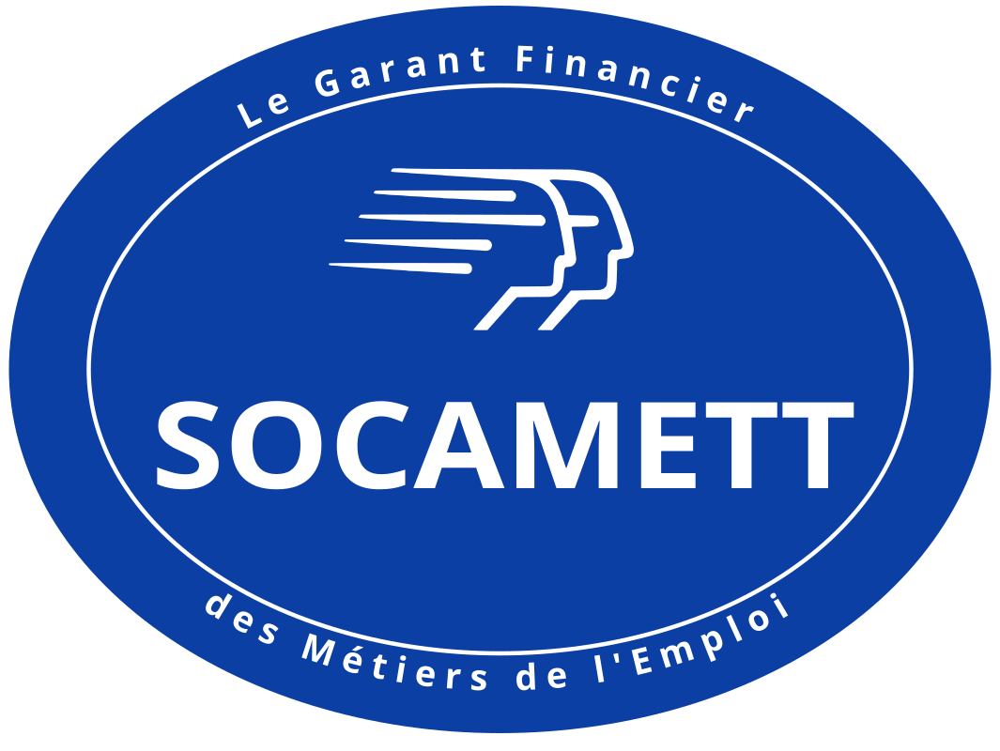

# Logo SOCAMETT

Version vectorielle nette du logo SOCAMETT, reconstruite à partir de la photo
d'origine, avec ses déclinaisons prêtes à l'emploi (SVG, PNG, JPEG) et ses
fichiers d'impression (PDF, EPS, CMJN).

**📥 Page de téléchargement : https://jlrigau.github.io/socamett-logo/**



## Contenu

| Fichier | Description |
|---|---|
| `socamett-logo.svg` | Master vectoriel — texte vectorisé, fond transparent, s'affiche partout sans dépendance de police |
| `logos/*_transparent.png` | PNG fond transparent (512 / 1065 / 2130 / 4260 px) |
| `logos/*_white.png` | PNG fond blanc (mêmes tailles) |
| `logos/*.jpg` | JPEG fond blanc, haute qualité (1065 / 2130 / 4260 px) |
| `print/` | Fichiers d'impression : PDF (RVB + CMJN), EPS, et la fiche couleurs |
| `photo-originale.png` | Photo d'origine (redressée), utilisée comme référence |

## Régénérer

Tout est généré depuis `build_logo.py` (la mise en page mesurée sur la photo).

```sh
./build.sh
```

Prérequis : `python3`, Inkscape, ImageMagick, Ghostscript, `npx` (svgo), et la
police **Open Sans** installée (le texte est rendu puis vectorisé en tracés).

Le pipeline : génère le SVG → vectorise le texte → optimise avec svgo → exporte
les déclinaisons PNG/JPEG → exporte les fichiers d'impression PDF/EPS/CMJN.

## Impression (carte de visite, papeterie)

Les fichiers vectoriels sont dans `print/` ; privilégiez-les pour l'impression.
La couleur de marque et les conseils (Pantone, CMJN, fond perdu) sont détaillés
dans **[`print/COULEURS.md`](print/COULEURS.md)**.

| Couleur | Valeur |
|---|---|
| HEX | `#0B3FA4` |
| RVB | 11 / 63 / 164 |
| CMJN | C100 M72 J0 N5 (build conseillé) |
| Pantone | 286 C (ou 293 C, le plus proche) |

## Publication

Le site de téléchargement est la page `index.html`, déployée automatiquement sur
GitHub Pages à chaque push sur `main` (voir `.github/workflows/deploy.yml`).
